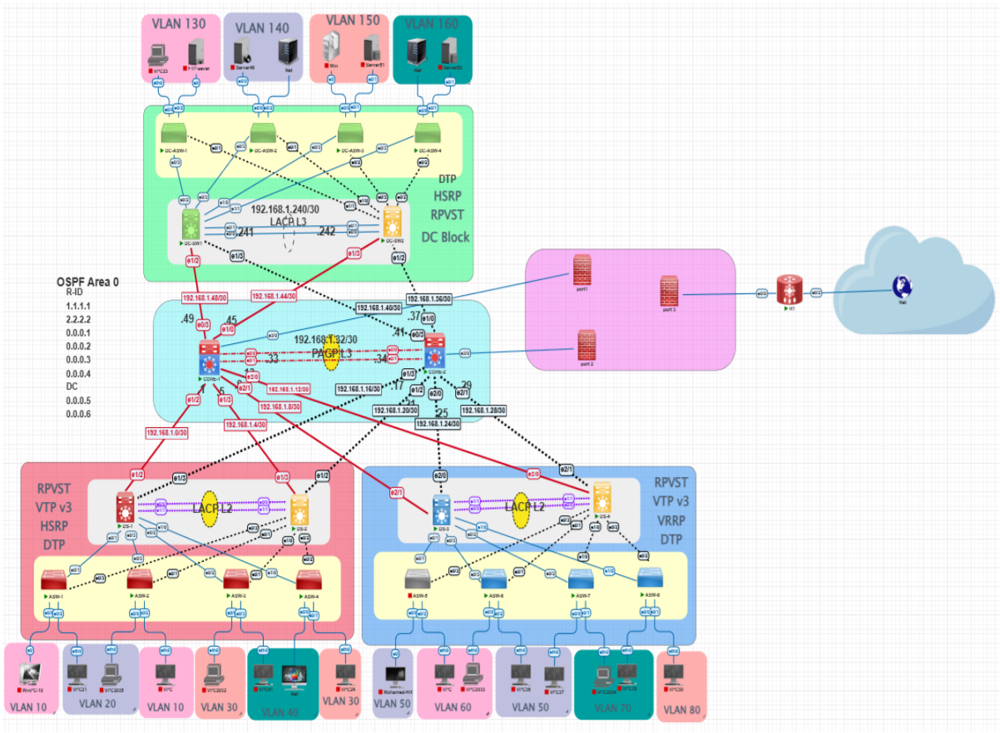

# Secure Enterprise Infrastructure Network & SIEM Integration

## Project Overview

This repository documents the design, deployment, and security hardening of an enterprise-grade network infrastructure that simulates a production corporate environment. The architecture spans three main sites: **Cairo Branch**, **Alexandria Branch**, and a **Centralized Data Center**.

The infrastructure is built upon **Cisco's Three-Tier Hierarchical Model** (Core, Distribution, and Access layers), engineered to deliver maximum scalability and high availability. It serves as a secure foundation for advanced security integrations, including **FortiGate Next-Generation Firewalls (NGFW)** and **IBM QRadar SIEM** for centralized security event logging and threat mitigation.

> **Role:** As the **Network Infrastructure Engineer** on this project, the end-to-end logical and physical topology was architected, Layer 2/3 redundancy was implemented, dynamic routing was configured, and infrastructure security hardening was applied across all switches and routers using the **PNETLab** network emulation platform.

---

## Table of Contents

1. [Network Topology & Hierarchical Design](#1-network-topology--hierarchical-design)
2. [Core Network & Redundancy Protocols](#2-core-network--redundancy-protocols)
  - [VTP v3](#a-vlan-trunking-protocol-vtp-v3)
  - [Rapid-PVST+](#b-rapid-per-vlan-spanning-tree-plus-rapid-pvst)
  - [EtherChannel (LACP)](#c-etherchannel-link-aggregation-control-protocol---lacp)
  - [HSRP](#d-hot-standby-router-protocol-hsrp)
3. [Infrastructure Hardening & Security Layer](#3-infrastructure-hardening--security-layer)
  - [SSH v2 & Device Hardening](#a-secure-shell-ssh-v2--device-hardening)
  - [Port Security](#b-port-security-sticky-mac-architecture)
  - [DHCP Snooping](#c-dhcp-snooping)
  - [Dynamic ARP Inspection](#d-dynamic-arp-inspection-dai)
  - [STP Hardening](#e-spanning-tree-custom-hardening-portfast--bpdu-guard)
4. [Business Value & Engineering Takeaways](#4-business-value--engineering-takeaways)

---

## 1. Network Topology & Hierarchical Design

The infrastructure follows a modular, three-tier approach designed to eliminate single points of failure and isolate broadcast domains.

| Layer | Function |
| --- | --- |
| **Core** | High-speed, reliable data transport between branches and the Data Center |
| **Distribution** | Enforces routing policies, handles inter-VLAN routing, implements redundancy |
| **Access** | Provides connectivity directly to end-user devices with strict security profiles |



---

## 2. Core Network & Redundancy Protocols

### A. VLAN Trunking Protocol (VTP v3)

**Purpose:** VTP v3 centrally manages and synchronizes VLAN creation, deletion, and naming across the enterprise switching fabric.

Version 3 was selected specifically because it:

- Supports extended VLANs (beyond VLAN 1005)
- Provides enhanced security through hidden/MD5 password encryption
- Prevents accidental VLAN database overrides via the Primary Server mechanism

**Configuration:**

```cisco
! Primary Server Switch
vtp domain ITI
vtp mode server
vtp version 3
vtp password HiddenSecretPassword123
vtp primary

! Client Switches
vtp domain ITI
vtp mode client
vtp version 3
vtp password HiddenSecretPassword123
```

---

### B. Rapid Per-VLAN Spanning Tree Plus (Rapid-PVST+)

**Purpose:** STP prevents Layer 2 switching loops and broadcast storms when redundant physical links exist. Rapid-PVST+ (IEEE 802.1w) achieves sub-second convergence during link failures.

Bridge priorities were manually tuned so that primary Distribution switches always serve as Spanning Tree Root Bridges, ensuring optimal traffic paths across the fabric.

**Configuration:**

```cisco
spanning-tree mode rapid-pvst

! Electing Root Bridges per VLAN for load distribution
spanning-tree vlan 10,20 root primary
spanning-tree vlan 30,40 root secondary
```

---

### C. EtherChannel — Link Aggregation Control Protocol (LACP)

**Purpose:** LACP (IEEE 802.3ad) bundles multiple physical Ethernet links between Core, Distribution, and Access switches into a single logical channel, achieving two goals simultaneously:

- **Increased bandwidth** through load balancing across bundled links
- **Instant link-level redundancy** — if one physical cable fails, traffic flows through the remaining links without triggering an STP topology change

**Configuration:**

```cisco
interface range GigabitEthernet0/1 - 2
 channel-protocol lacp
 channel-group 1 mode active
 switchport mode trunk
```

---

### D. Hot Standby Router Protocol (HSRP)

**Purpose:** HSRP is a First Hop Redundancy Protocol (FHRP) deployed at the Distribution layer to provide a highly available virtual default gateway (VIP) for end-user workstations. If the active gateway switch fails, the standby switch assumes control of the VIP within milliseconds, ensuring zero downtime for users.

**Configuration:**

```cisco
! Primary Distribution Switch — Active Gateway
interface Vlan10
 ip address 192.168.10.2 255.255.255.0
 standby 10 ip 192.168.10.1
 standby 10 priority 110
 standby 10 preempt

! Backup Distribution Switch — Standby Gateway
interface Vlan10
 ip address 192.168.10.3 255.255.255.0
 standby 10 ip 192.168.10.1
 standby 10 priority 100
 standby 10 preempt
```

---

## 3. Infrastructure Hardening & Security Layer

To defend against both external threats and internal attacks, a comprehensive set of Layer 2 and Layer 3 security measures was implemented across the entire switching fabric.

### A. Secure Shell (SSH v2) & Device Hardening

**Purpose:** Disables legacy, unencrypted Telnet access and replaces it with SSH v2, which encrypts all management traffic — including administrative commands and credentials — between the administrator's terminal and the Cisco devices.

Additional controls applied include local authentication databases and session timeout policies.

**Configuration:**

```cisco
hostname SWC-Distribution-01
ip domain-name iti.local
crypto key generate rsa general-keys modulus 2048
ip ssh version 2
ip ssh time-out 60
ip ssh authentication-retries 3

username administrator privilege 15 secret SecureAdminPassword!

line vty 0 4
 transport input ssh
 login local
```

---

### B. Port Security — Sticky MAC Architecture

**Purpose:** Port Security mitigates MAC Flooding attacks and prevents unauthorized hardware (rogue laptops, access points) from connecting to edge switchports.

Using the `sticky` feature, the switch dynamically learns the legitimate device's MAC address and saves it to the running configuration. Any foreign MAC address triggers an immediate defensive shutdown of the port.

**Configuration:**

```cisco
interface range GigabitEthernet1/0 - 24
 switchport mode access
 switchport port-security
 switchport port-security maximum 1
 switchport port-security violation shutdown
 switchport port-security mac-address sticky
```

---

### C. DHCP Snooping

**Purpose:** DHCP Snooping acts as a firewall between untrusted hosts and the DHCP server. It builds a binding table of legitimate IP-to-MAC allocations and drops malicious DHCP Offer packets originating from unauthorized (rogue) DHCP servers attempting Man-in-the-Middle attacks.

**Configuration:**

```cisco
ip dhcp snooping
ip dhcp snooping vlan 10,20,30

! Mark uplink ports toward the legitimate DHCP Server as trusted
interface GigabitEthernet0/1
 ip dhcp snooping trust
```

---

### D. Dynamic ARP Inspection (DAI)

**Purpose:** DAI prevents ARP Spoofing and ARP Poisoning attacks. It intercepts all incoming ARP requests and replies on untrusted ports and validates them against the binding database built by DHCP Snooping. Spoofed or invalid ARP packets are immediately discarded before they can poison the ARP cache of other hosts.

**Configuration:**

```cisco
ip arp inspection vlan 10,20,30

! Mark trusted inter-switch uplinks to avoid dropping legitimate ARP traffic
interface GigabitEthernet0/1
 ip arp inspection trust
```

---

### E. Spanning Tree Custom Hardening — PortFast & BPDU Guard

**Purpose:**

- **PortFast** transitions access ports directly into the STP forwarding state, bypassing the listening and learning phases so end devices receive network connectivity immediately upon connection.
- **BPDU Guard** is the critical security complement to PortFast. If a user connects an unauthorized switch to an access port, that switch will emit STP BPDU frames. BPDU Guard detects this and immediately places the port into `err-disable` state, protecting the STP topology from manipulation.

**Configuration:**

```cisco
interface range GigabitEthernet1/0 - 24
 switchport mode access
 spanning-tree portfast
 spanning-tree bpduguard enable
```

---

## 4. Business Value & Engineering Takeaways

Deploying and securing infrastructure at this scale aligns directly with professional data center standards and yields measurable operational benefits:

**SIEM Readiness**
Hardening the network at Layers 2 and 3 stabilizes the logging environment. When events are forwarded to IBM QRadar SIEM, logs represent clean, trustworthy traffic. Anomalous events — such as an HSRP state change or a Port Security violation shutdown — generate immediate, actionable alerts for the security team.

**Business Continuity (High Availability)**
The combination of HSRP, LACP, and Rapid-PVST+ eliminates every single point of network failure. Physical link outages and switch hardware failures are completely transparent to business operations — users experience no downtime.

**Defense-in-Depth**
Security is not delegated solely to the perimeter firewall. By locking down switchports, validating DHCP assignments, and inspecting ARP traffic, the internal corporate environment is structurally hardened against internal lateral movement — even if an attacker reaches the LAN.

---

## Project Team

Architected, configured, and documented as part of the B.Sc. Computer Science & Engineering Graduation Project.

| Name | Role |
| --- | --- |
| Mohamed Mostafa Nada | Network Infrastructure Engineer |
